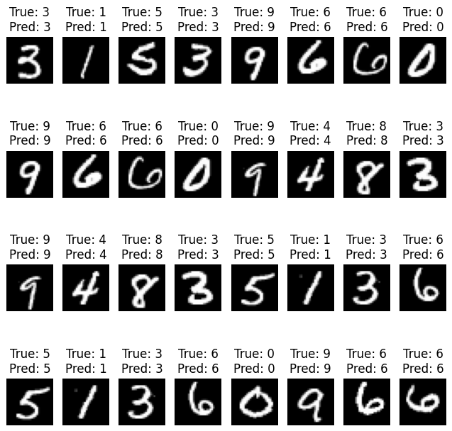

# Распознавание рукописных цифр (MNIST)

## Описание проекта

Учебный проект по работе с датасетом **MNIST** для распознавания рукописных цифр.
Реализована **свёрточная нейросеть (TinyVGG)** на PyTorch, обученная на 5 эпохах.
Модель показывает высокую точность на тестовых данных.

**Результат обучения:**

* Точность на трейне: \~98.6%
* Точность на тесте: \~98.7%
* SOTA для MNIST: \~99.8% (модель LeNet-5, ResNet, Ensemble)

## Стек технологий

* Python
* PyTorch
* Torchvision
* Matplotlib
* NumPy, Pandas
* tqdm

## Структура

* Загрузка и предобработка датасета MNIST
* Определение архитектуры **TinyVGG**
* Обучение и валидация модели (CrossEntropyLoss + SGD)
* Визуализация результатов и сравнение с эталонными значениями

## Результаты обучения

Пример лога после 5 эпох обучения:

```
Epoch: 4... Mean Loss: 0.0440 | Mean Acc: 98.62
   TEST  Epoch: 4... Mean Loss: 0.0414 | Mean Acc: 98.69
```

## Визуализация предсказаний

После обучения модель способна предсказывать цифры:

